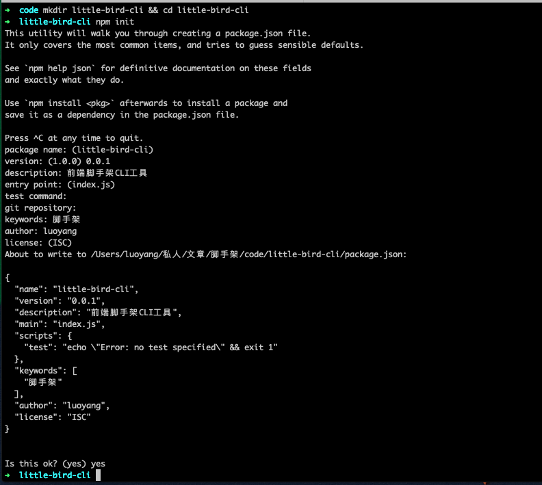
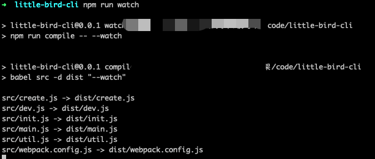
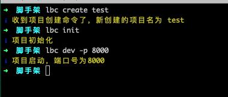
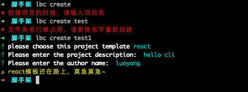
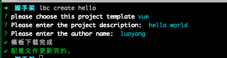
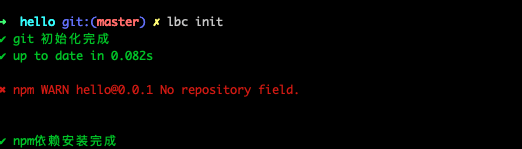
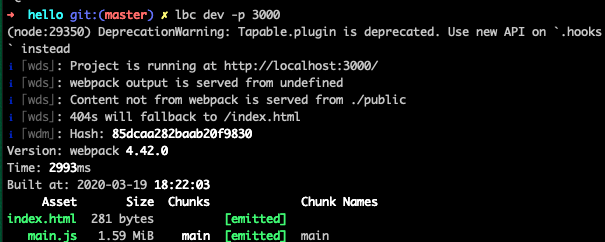
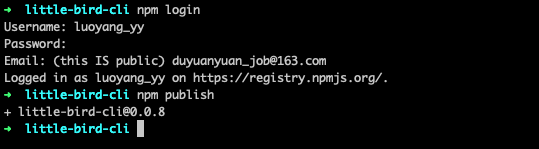
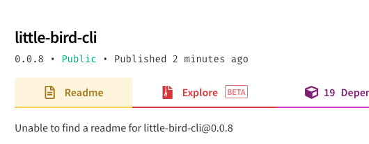
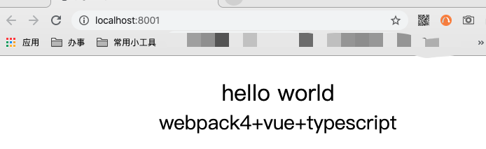

## 《前端脚手架 CLI》程序员高配

### 一、前言

从静态页面到 JavaScript，从依赖后端到自主开发，从没有专职的“前端开发“到高薪“前端开发”，前端经历了一个漫长的发展过程，前端技术也发展到了前所未有的高度，对前端开发者的能力要求也越来越高。如果你不甘于只做搬运工，想要低配变高配，下面这个东西一定要好好了解下。来！左手跟我一起画条龙，右手画一道彩虹！你就是最屌的窜天猴。

### 二、概念

CLI，全称是 command-line interface，也就是命令行界面。前端脚手架 CLI，是一个命令行工具，
它的出现是为了减少重复性工作、规范目录结构、统一开发风格，让事情简单化，一键命令就可以根据事先约定的规范创建项目，再执行一个命令就可以运行项目，让开发者无需关注配置什么的，只需要开心写代码，相同的项目结构和代码规范，很利于项目的后期维护，提高效率的同时还降低了学习成本。

随着前端工程化的理念不断深入，越来越多的人选择使用脚手架来从零到一搭建自己的项目。其中大家最熟悉的就是 create-react-app 和 vue-cli，它们可以帮助我们”搭建-运行-构建“项目。虽然业界已经有成熟的脚手架供我们使用，但是在我们自己开发的过程中会发现，随着业务的不断年发展，必然会出现需要针对业务开发的实际情况来进行调整，比如项目架构调整、融合公司开发工具等，这就需要我们沉淀出一套属于自己的更加”个性化“的业务方案。这时如果你能为公司开发一个定制化的脚手架，那么你会发现整个公司前端都是你的天下，你就是公司最亮的仔😆。

大家熟悉的脚手架基本都是 Nodejs 开发的,所以这里我们也简单介绍下在搭建脚手架 CLI 时候需要了解的 Nodejs 相关的一些基础知识。通过 `npm init` 可以初始化一个 node 项目，并可以根据命令行询问输入生成一个 package.json 配置文件，最重要的是 package.json 可配置 bin 字段用来指定各个内部文件可执行文件的位置，初始化的时候 npm 会将它直接导入到全局路径里，打成全局包的命令直接使用。

### 三、思路

在动手开始开发前端脚手架 CLI 之前我们需要先捋一下思路，纵览业界比较流行的几个脚手架，我们会发现虽然它们功能丰富度和复杂程度不一样，但是总体来说都会包含以下几个功能：

* CLI 搭建项目
    - 根据用户输入生成配置文件
    - 下载指定项目模板
    - 在目标目录生成新项目
* CLI 运行项目
    - 本地启动预览
    - 热更新
    - 语法、代码规范检测
* 部署项目
    - 项目部署到服务端

上面是脚手架要实现的功能，同时我们肯定也希望自己的脚手架有更广泛的应用，所以还要思考如何提供给他人使用，如何提供一个他人倾心的脚手架，让大家爱上它，给它小心心♥(ˆ◡ˆԅ)。

* npm 包的方式提供脚手架
* 优雅的输出日志，清晰好看

##### 依赖分析
为了实现我们神奇伟大的脚手架，可以引入以下依赖：

* babel-cli/babel-env：语法转换工具，有了它我们在开发脚手架的时候就可以使用 ES6 语法了，不要问我为什么要用 ES6，因为它神奇而伟大
* commander：命令行工具，有了它我们就可以读取命令行命令，知道用户想要做什么了
* inquirer： 交互式命令行工具，给用户提供一个漂亮的界面和提出问题流的方式
* download-git-repo：下载远程模板工具，负责下载远程仓库的模板项目
* chalk：颜色插件，用来修改命令行输出样式，通过颜色区分 info、error 日志，清晰直观
* ora：用于显示加载中的效果，类似于前端页面的 loading 效果，像下载模板这种耗时的操作，有了 loading 效果可以提示用户正在进行中，请耐心等待
* log-symbols：日志彩色符号，用来显示√ 或 × 等的图标

### 四、前期准备

####4.1 准备一个项目模板

脚手架可以帮助我们快速生成一套指定的项目结构和配置，最常用的方式就是我们提前准备好一套通用的、易用的、规范的项目模板存放在指定位置，在脚手架执行创建项目命令的时候，直接将准备好的模板拷贝到目标目录下。这里有两个点需要我们关注一下

* 项目模板存放位置

    项目模板存放通常有两种方式，一种是和脚手架打包在一起，在安装脚手架的时候就会将项目模板存放在全局目录下了，这种方式每次创建项目的时候都是从本地拷贝的速度很快，但是项目模板自身升级比较困难。另一种是将项目模板存在远端仓库（比如 github、gitlab 等仓库），这种方式每次创建项目的时候都是通过某个地址动态下载的，项目模板更新方便。我更喜欢用远端仓库存储的方式，解耦了模板和脚手架，方便更新维护。

* 项目模板功能丰富度

    所谓项目模板，必然是一个可以作为标杆的项目，我们可以从日常用到的经典项目看出，一个成熟的项目必然支持本地启动打包、支持热更新、支持预发规则和代码风格检查，支持比较流行的语言框架（比如 less，scss 等），更完善点还会支持单元测试。

如果大家只是想要快速了解脚手架的搭建流程，可以用比较熟悉的 [create-react-app](https://www.html.cn/create-react-app/docs/getting-started/) 和 [vue-cli](https://cli.vuejs.org/zh/guide/cli-service.html)搭建一个项目作为模板项目。当然我是一个有追求有洁癖的页面仔，喜欢自己动手丰衣足食，所以项目模板我还是从零开始搭建了一个 webpack4+vue+typescript 的项目，项目搭建介绍放在文章后面，志趣相投的人可以移步下面去看👀[从零开始搭建项目](#从零开始搭建项目)

####4.2 了解如何发布 npm 包

首先你要准备一个 npm 账号，如果没有请到[官网](https://www.npmjs.com) 注册。有了账号后就可以进行 npm 包的开发和发布了。

1. 初始化。进入要发布的项目根目录执行`npm init`将其初始化为 npm 包，生成 package.json 文件
2. 登录。在项目根目录执行`npm login`，根据提示输入注册的用户名、密码和邮箱
3. 发布。在项目跟目录执行`npm publish`
4. 查看。发布成功之后就可以在[npm 官网](https://www.npmjs.com)查看到自己的包了

在发布的过程中可能因为使用了 npm 镜像导致失败，可以按照如下步骤使用[nrm](https://www.npmjs.com/package/nrm)切换镜像，然后再发布
```plain
npm i -g nrm // 安装nrm

nrm ls // 输出所有镜像

nrm use npm //切换镜像
```

朋友们在给自己的 npm 包起名字的时候，可以先去[npm 官网](https://www.npmjs.com)查下是否已经存在同名包，比较世界之大某个角落总会有那么一个人和你志同道合，喜欢上同一个名字。


### 五、实现

前面该说的都说了，接下来让我们动起来，手把手教你搭建脚手架。我们先通过图了解下脚手架的大致工作流程。


####5.1 准备脚手架项目

第一步：创建名为 little-bird-cli 的文件夹作为脚手架项目名。【最初是想要叫 free-cli 的，因为我爱自由，一切我来创建我来写😆，[官网](https://www.npmjs.com)查看已存在，可是自由的心不变呀，所以变成了小小鸟，在这里劝大家起名要趁早，学习要趁早】

```plain
mkdir little-bird-cli && cd little-bird-cli
```

第二步：npm 初始化，从上文可以了解到，要先初始化为 npm 包，后面才可以发布的。
```plain
npm init // 初始化后会生成一个package.json文件
```



第三步：修改 packgage.json。

* 修改 package.json 中的 bin 参数，专门放置用户的自定义命令，指定可执行文件的位置，bin 里的命令是可执行命令，模块安装的时候如果是全局安装，则 npm 会为 bin 中配置的文件创建一个全局软连接，在命令行工具里可以直接执行。
* 修改 package.json 中的 scripts 参数，指定可执行命令，实时编译脚本，让 node 能够识别并执行。

>package.json

```plain
{
  "name": "little-bird-cli",
  "version": "0.0.1",
  "description": "前端脚手架CLI工具",
  "main": "index.js",
  "scripts": {
     "compile": "babel src -d dist",
    "watch": "npm run compile -- --watch"
  },
  "bin": {
        "little-bird-cli": "./bin/cmd",
        "lb-cli": "./bin/cmd",
        "lbc": "./bin/cmd"
  },
  "keywords": [
    "脚手架"
  ],
  "author": "luoyang",
  "license": "ISC"
}
```

* 新建 .babelrc 配置文件，支持 ES6 预发转义

>.babelrc

```plain
{
    "presets": [
        [
            "env",
            {
                "targets": {
                    "node": "current"
                }
            }
        ]
    ]
}
```

* 安装依赖分析里列出来的那些依赖

```plain
npm install --save babel-cli babel-env commander inquirer download-git-repo chalk ora log-symbols
```

* 补全目录结构

```plain
├── bin
│   └── cmd            //可执行文件
├── dist
    ├── ...             //编译后的生成文件
└── src
    ├── main.js         // 入口文件
    ├── create.js       // 项目创建
    ├── init.js         // 项目初始化
    ├── dev.js         // 项目启动
    ├── util.js         // 工具文件，包括一些基础方法： 判断文件是否存在，下载模板等
    └── webpack.config.js // 项目打包配置文件，可以把模板项目里的通用打包配置放在脚手架里维护，用户不用关心打包配置
├── .babelrc
├── package.json
├── README.md
```

###5.2 配置全局 CLI 命令

我们的脚手架开发完成发布到 npm 后，可以通过`npm install -g free-cli`全局安装的方式安装就可以直接使用 CLI 命令了，但是开发过程中为了方便调试和实时同步修改，还需要另外的方式将 CLI 命令链接到全局。可以在 little-bird-cli 目录下执行`npm link`，该命令可以将 little-bird-cli 下的 bin 命令软链接到全局，直接使用。

在使用`npm link`的时候遇到过几个小坑这里也给大家分享一下。在开发的过程中可能会遇到执行命令失败的情况，比如`zsh: command not found: little-bird-cli` ，这时候我们可以尝试重新链接`npm link`，再失败的话就尝试先删除掉全局命令`npm unlink little-bird-cli`然后再链接，一般情况下这样就可以解决了。但有时候也会遇到顽疾这个时候就要使用终极大法了，去全局目录里删除【下面是 mac 的情况，window 的可以根据错误提示找到全局目录】，方法如下

```plain
/usr/local/bin   // 进入全局命令目录
rm -rf little-bird-cli  // 删除命令
```

###5.3 项目启动

项目启动前，我们先配置下可执行文件，写个简单的 demo，用来启动后验证项目可以正常运转。可执行文件的行首一定要加入`#!/usr/bin/env node`这行代码可以告诉系统该脚本可以由 node 来执行。

>bin/cmd

```plain
#!/usr/bin/env node
require('../dist/main.js');
```

>src/main.js

```plain
console.log('我是一个可以正常运行的项目啦！！！')
```

开启项目的实时监控`npm run watch`，这样我们修改代码的时候就会实时更新了。


接下来见证奇迹的时候到了，可以随便找一个目录执行 bin 里自定义的命令【作为一个急性子，多一个字母都不愿意写，所以我会用最简单的那个命令😆`lbc`】


###5.4 处理命令行

我们通过 commander 来设置不同的命令。command 方法设置命令的名字、description 方法是设置命令的描述、alias 方法设置命令简称【懒人必备】、options 设置命令需要的参数。commander 更详细的文档可以去 commander[官网](https://github.com/tj/commander.js/)查看。我们脚手架先加入三个命令：项目创建、项目初始化、项目启动。

>src/main.js

```plain
import program from 'commander';
import symbol from 'log-symbols';
import chalk from 'chalk';

import create from './create'; // 项目创建
import init from './init'; // 项目初始化
import dev from './dev'; // 项目启动

/**
 * little-bird-cli 命令列表
 */

let actionMap = {
    // 项目创建
    create: {
        description: '创建一个新的项目', // 描述
        usages: [// 使用方法
            'little-bird-cli create ProjectName',
            'lb-cli create ProjectName',
            'lbc create ProjectName'
        ],
        alias: 'c' // 命令简称
    },
    // 项目初始化
    init: {
        description: '初始化项目',
        usages: [
            'little-bird-cli init',
            'lb-cli init',
            'lbc init'
        ],
        alias: 'i'
    },
    // 启动项目
    dev: {
        description: '本地启动项目',
        usages: [
            'little-bird-cli dev',
            'lb-cli dev',
            'lbc dev'
        ],
        options: [
            {
                flags: '-p --port <port>',
                description: '端口',
                defaultValue: 3000
            }
        ],
        alias: 'd'
    }
}

// 添加create,init,dev命令
Object.keys(actionMap).forEach(action => {

    if (actionMap[action].options) {
        Object.keys(actionMap[action].options).forEach(option => {
            let obj = actionMap[action].options[option];
            program.option(obj.flags, obj.description, obj.defaultValue);
        })
    }

    program
        .command(action)
        .description(actionMap[action].description)
        .alias(actionMap[action].alias)
        .action(() => {
            switch (action) {
                // 到这里具体命令实现逻辑还空缺，我们先打日志，看下命令处理情况
                case 'create':
                    const ProjectName = process.argv.slice(3);
                    console.log(symbol.info, chalk.yellow(`收到项目创建命令了，新创建的项目名为 ${ProjectName}`));
                    // create(...process.argv.slice(3));
                    break;
                case 'init':
                    console.log(symbol.info, chalk.yellow(`项目初始化`));
                    // init(...process.argv.slice(3));
                    break;
                case 'dev':
                    console.log(symbol.info, chalk.yellow(`项目启动，端口号为${program.port}`));
                    // dev(program.port);
                    break;
                default:
                    break;
            }
        })
});

// 项目版本
program
    .version(require('../package.json').version, '-v --version')
    .parse(process.argv);

/**
 * little-bird-cli命令后不带参数的时候，输出帮助信息
 */
if (!process.argv.slice(2).length) {
    program.outputHelp();
}

```

执行命令输出结果



###5.5 项目创建

项目创建思路如下：

* 项目创建命令必须输入新建项目名称
* 当前路径下是否存在相同文件名，如果不做这层判断新生成的项目可能会覆盖你已有的项目
```plain
    // 判断文件是否已经存在
    let notExistFold = async (name) => {
    return new Promise((resolve) => {
        if (fs.existsSync(name)) {
            console.log(symbol.error, chalk.red('文件夹名已被占用，请更换名字重新创建'));
        } else {
            resolve();
        }
    });
}
```

* 询问用户，引导用户输入配置信息
```plain
// 询问用户
let promptList = [
    {
        type: 'list',
        name: 'frame',
        message: 'please choose this project template',
        choices: ['vue', 'react']
    },
    {
        type: 'input',
        name: 'description',
        message: 'Please enter the project description: '
    },
    {
        type: 'input',
        name: 'author',
        message: 'Please enter the author name: '
    }
];

let prompt = () => {
    return new Promise(resolve => {
        inquirer
            .prompt(promptList)
            .then(answer => {
                resolve(answer);
            })
    });
}
```
* 下载模板项目，下载模版比较耗时，通过 ora 提示用户正在下载模版，下载结束后再给出提示
```plain
// api为远端地址，ProjectName为项目创建时输入的项目名
let  downloadTemplate = async (ProjectName, api) => {
    return new Promise((resolve, reject) => {
        downloadGit(api, ProjectName, {clone: true}, (err) => {
            if(err){
                reject(err);
            }else{
                resolve();
            }
        })
    });
};
```
* 项目下载完成后，根据用户输入更新配置文件
```plain
// 更新json配置文件
let updateJsonFile = (fileName, obj) => {

    return new Promise(resolve => {
        if(fs.existsSync(fileName)){
            const data = fs.readFileSync(fileName).toString();
            let json = JSON.parse(data);
            Object.keys(obj).forEach(key => {
                json[key] = obj[key];
            });
            fs.writeFileSync(fileName, JSON.stringify(json, null, '\t'), 'utf-8');
            resolve();
        }
    });
}
```

启动项目要用的工具方法已经写好，下面我们进入创建正文：

>src/create.js

```plain


import symbol from 'log-symbols';
import chalk from 'chalk';
import ora from 'ora';

import {
    notExistFold,
    prompt,
    downloadTemplate,
    updateJsonFile
} from './util';

let create = async (ProjectName) => {

    // 项目名不能为空
    if (ProjectName === undefined) {
        console.log(symbol.error, chalk.red('创建项目的时候，请输入项目名'));
    } else {
        // 如果文件名不存在则继续执行,否则退出
        notExistFold(ProjectName).then(() => {

            // 用户询问交互
            prompt().then((answer) => {

                // 目前只建了一个vue的模板，所以只能先跳过react🌶 
                if (answer.frame === 'react') {
                    console.log(symbol.warning, chalk.yellow('react模板还在路上，莫急莫急~'));
                    process.exit(1);
                }

                /**
                 * 根据用户输入的配置信息下载模版&更新模版配置
                 * 下载模版比较耗时,这里通过ora插入下载loading, 提示用户正在下载模版
                 */
                let loading = ora('模板下载中...');
                loading.start();

                let Api = '';
                switch (answer.frame) {
                    case 'vue':
                        Api = 'direct:https://github.com/LuoYangYY/vue-template.git';
                        break;
                    case 'react':
                        Api = 'direct:https://github.com/LuoYangYY/react-template.git';
                        break;
                    default:
                        break;
                }

                downloadTemplate(ProjectName, Api)
                .then(() => {

                    loading.succeed('模板下载成功');

                    // 下载完成后,根据用户输入更新配置文件
                    const fileName = `${ProjectName}/package.json`;
                    answer.name = ProjectName;
                    updateJsonFile(fileName, answer)
                    .then(() => {
                        console.log(symbol.success, chalk.green('Project package.json
                         update finished!'));
                    })
                }, () => {
                    loading.fail('模板下载失败');
                });
            })
        });
    }
};

module.exports = create;

```

异常情况输出



项目创建成功输出



###5.6 项目初始化

项目初始化主要做以下几点：

* 安装依赖，为了减小项目模板包的大小，下载的模板里不包含 node_modules 目录，创建完成之后要安装依赖
* 初始化 git 仓库，方便代码提交管理
* 自动在远端生成 git 仓库，这一步后续文章补充，这里就先不写了

>src/init.js

```plain
import child from 'child_process';
import symbol from 'log-symbols';
import chalk from 'chalk';

let init = () => {
    child.exec(`git init`, () => {
        console.log(symbol.success, chalk.green('git 初始化完成'));
        child.exec(`npm install`, (error, stdout, stderr) => {
            console.log(symbol.success, chalk.green(stdout));
            console.log(symbol.error,  chalk.red(stderr));
            if (error !== null) {
                console.log(symbol.error, chalk.red(error));
            }else{
                console.log(symbol.success,  chalk.green('npm依赖安装完成'));
            }
        },(err)=> {
            console.log(err)
        })
    },(err)=> {
        console.log(err)
    })
}

module.exports = init;
```

进入到项目目录，执行初始化命令【这里有个保存是因为没有添加远端仓库，不影响使用的】



###5.7 项目启动

所谓项目启动就是说可以让我们的项目本地运行。前端项目本地运行我们通常会借助前端自动化构建工具来实现，我们可以认为它是一个前端集成开发环境，能够合理、快速和高效的解决前端开发中的工程和项目问题，集成了本地调试、本地构建、远程部署、代码校验等一些列开发工具。其中最为突出的当属于用户模块化打包的 webpack 和用户任务流程构建的 Gulp。接下来我们就是借助 webpack 来实现我们脚手架的本地启动。

先来做下依赖分析【主要针对我自己搭的 webpack4+vue+typescript 项目】

* 在 webpack4 中已经将 webpack 和它的 cli 分开了，所以需引入 webpack 和 webpack-cli
* 支持热更新，需引入 webpack-dev-server
* 当使用 webpack 打包时，创建一个 html 文件，并把 webpack 打包后的静态文件自动插入到这个 html 文件当中，需引入 html-webpack-plugin
* 支持启动后自动打开浏览器，需引入 open-browser-webpack-plugin
* 支持 vue 解析，需引入 vue-loader 和 vue-template-compiler
* 支持 style、css、less 解析,需引入 style-loader、css-loader 和 less-loader
* 支持 typescript， 需引入 ts-loader

* 在脚手架目录(little-bird-cli)下安装依赖

```plain
npm i webpack webpack-cli  webpack-dev-server html-webpack-plugin
 open-browser-webpack-plugin vue vue-loader vue-template-compiler style-loader 
 css-loader less less-loader typescript ts-loader -S
```

* 准备 webpack 配置文件

>src/webpack.config.js

```plain


const VueLoaderPlugin = require('vue-loader/lib/plugin'); //引入vue-loader库
const HtmlWebpackPlugin = require('html-webpack-plugin');

module.exports = {
    mode: 'development', // production
    watch: true,
    watchOptions: {
        // 不监听的文件或文件夹，支持正则匹配
        // 默认为空
        ignored: /node_modules/,
        // 监听到变化发生后会等300ms再去执行动作，防止文件更新太快导致重新编译频率太高
        // 默认为 300ms
        aggregateTimeout: 300,
        // 判断文件是否发生变化是通过不停的去询问系统指定文件有没有变化实现的
        // 默认每隔1000毫秒询问一次
        poll: 1000
    },
    entry: './src/index.ts', // 入口文件
    devtool: 'cheap-module-eval-source-map', //不包含列信息，同时 loader 的 sourcemap 也被简化为只包含对应行的
    module: {
        rules: [{
            test: /\.vue$/,
            use: 'vue-loader'
        }, //vue加载器
        {
            test: /\.tsx?$/,
            loader: 'ts-loader', //ts加载器
            options: {
                transpileOnly: true,
                appendTsSuffixTo: [/.vue$/]
            }  //认识vue文件

        }, {
            test: /\.(css|less)$/,
            loader: 'vue-style-loader!less-loader!css-loader'
        } //css加载器
        ]
    },
    plugins: [new VueLoaderPlugin()  //vue-loader插件加载方式
        ,new HtmlWebpackPlugin({ //此部分新增加
            template: './public/index.html',//需要自动注入的模板的文件名称
            inject: true//是否自动注入生成后的文件
        })
    ],
    devtool: '#eval-source-map'
}
```

* 写启动命令

>src/dev.js

```plain
import webpack from "webpack";
import WebpackDevServer from 'webpack-dev-server';
const OpenBrowserPlugin = require('open-browser-webpack-plugin');

const config = require('./webpack.config.js');

let dev = (port) => {
    // 启动项目后自动打开浏览器
    config.plugins.push(new OpenBrowserPlugin({ url: `http://localhost:${port}` }))
    new WebpackDevServer(webpack(config), {
        contentBase: './public',
        hot: true,
        historyApiFallback: true
    }).listen(port, 'localhost', function (err, result) {
        if (err) {
            console.log(err);
        }
    });
}

module.exports = dev;
```

项目启动命令完成，我们可以去刚才创建的项目里试一下了


### 5.8 发布&使用

当当当...小伙伴们迫不及待看成品了吧，再等一下，让我们先发布



在 npm[官网](https://www.npmjs.com)查看是否可以搜到



完成！可以通过`npm i -g little-bird-cli`安装脚手架包，装之前最好先把之前开发时链到全局的命令删除掉，安装成功之后就可以使用了 biubiubiubiu~

```plain
npm unlink little-bird-cli
npm unlink lb-cli
npm unlink lbc
npm i -g little-bird-cli
```

执行`lbc dev -p 8001`浏览器会自动打开访问本地项目



### 六、拓展

除了实现模板创建和本地启动的功能，还可以在此基础上进一步拓展，比如版本校验、脚手架更新、webpack 自定义、代码校验、自动化测试等，这些都可以作为开发者的辅助工具，提高开发效率。本文只是带大家入门，感兴趣的同学可以继续深入尝试。

### 七、从零开始搭建项目

这里介绍一下 WebPack 4 +TypeScript 3 +Vue +less 简单环境搭建

####7.1 项目初始化
```plain
mkdir vue-template && cd vue-template
mkdir public
mkdir src && cd  src
mkdir components 
mkdir assets
cd ../
npm init
git init
```

####7.2 依赖安装

* Typescript 的相关安装
```plain
npm i typescript ts-loader --save-dev
```

* webpack 的相关安装
```plain
npm i webpack webpack-cli --save-dev
```

* vue 的相关安装
```plain
npm i vue vue-loader vue-template-compiler --save-dev
```

* css 相关安装
```plain
npm i css-loader style-loader less less-loader -save-dev
```

* 其他插件安装
```plain
npm i html-webpack-plugin webpack-dev-server --save-dev 
```

####7.3 配置文件
* 项目根目录创建 tsconfig.json（开始用不上，但是该文件创建后无需要变动）
* 项目根目录创建 webpack.config.json
```plain
const path = require('path');
const VueLoaderPlugin = require('vue-loader/lib/plugin'); //引入vue-loader库
const HtmlWebpackPlugin = require('html-webpack-plugin');

module.exports = {
    entry: './src/index.ts', // 入口文件
    devtool: 'cheap-module-eval-source-map', //不包含列信息，同时 loader 的 sourcemap 也被简化为只包含对应行的
    module: {
        rules: [{
            test: /\.vue$/,
            use: 'vue-loader'
        }, //vue加载器
        {
            test: /\.tsx?$/,
            loader: 'ts-loader', //ts加载器
            options: {
                transpileOnly: true,
                appendTsSuffixTo: [/.vue$/]
            }  //认识vue文件

        }, {
            test: /\.(css|less)$/,
            loader: 'vue-style-loader!less-loader!css-loader'
        } //css加载器
        ]
    },
    plugins: [new VueLoaderPlugin()  //vue-loader插件加载方式
        ,new HtmlWebpackPlugin({ //此部分新增加
            template: './public/index.html',//需要自动注入的模板的文件名称
            inject: true//是否自动注入生成后的文件
        })
    ],
    devtool: '#eval-source-map'
}

```

* 修改配置文件 package.json
```plain
"scripts": {
    "dev":"webpack-dev-server --open --mode development"
}
```

####7.4 新建文件
* public 目录新建主入口文件 index.html
```plain
 <!DOCTYPE html>
<html>
  <head>
    <meta charset="utf-8">
    <meta name="viewport" content="width=device-width,initial-scale=1.0">
    <title>vue-template</title>
  </head>
  <body>
    <div id="app"></div>
  </body>
</html>
```
* src 目录新建 vue 模板文件 App.vue
```plain
<template>
    <div>
        {{msg}}
    </div>
</template>

<script lang="ts">
import Vue from 'vue'
export default Vue.extend({
    data() {
        return {
            msg: 'hello world'
        }
    },
})
</script>
```

* src 目录下新建 vue 入口文件 index.ts
```plain
import Vue from 'vue'
import App from './App.vue';

new Vue(
    {
        el:'#app',
        render:h=>h(App)
    }
)
```

####7.5 启动项目

```plain
npm run dev
```

####7.6 精简

一个简单 WebPack 4 +TypeScript 3 +Vue +less 项目已经搭完了，作为脚手架的项目模板，有些功能我们会直接继承到脚手架里，所以还会对上面搭建的项目模板做些精简工作。比如项目启动会继承到脚手架里，那么该项目里的相关内容则可去掉
* 去掉 package.json 的 dev 命令
* 清空 webpack.config.js
* 删除依赖：html-webpack-plugin webpack-dev-server
